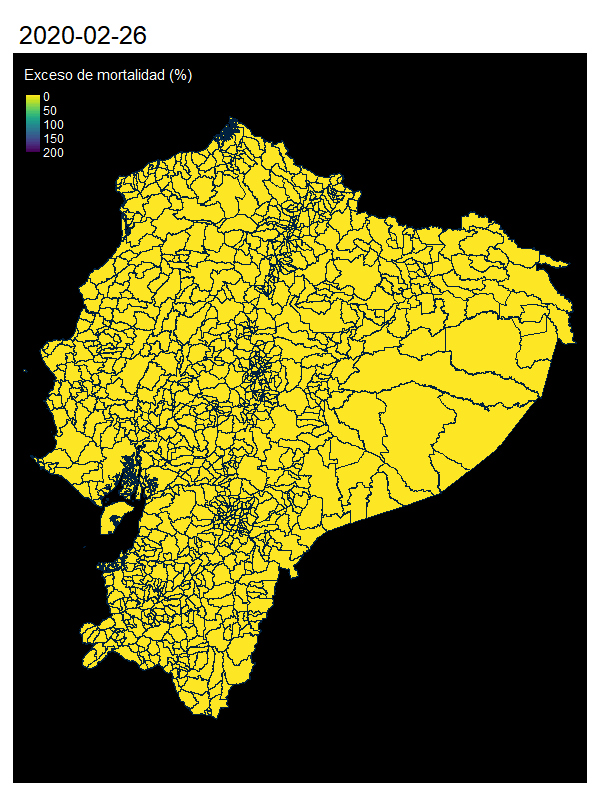

```{r setup, include=FALSE}
knitr::opts_chunk$set(echo = T,warning = F,message = F)
pks<-c("knitr","httr","stringr","readxl","foreign","tidyverse","sf","tmap",
       "viridis")
lapply(pks,require,character.only=T)
uac <- function(text) { #Unaccent Shit 
  text <- gsub("\\s+"," ",text)
  text <- tolower(iconv(text,"UTF-8", "ASCII//TRANSLIT"))
  text <- gsub("\\(.*\\)|['`^~\"]|[^[:alnum:][:space:]]","", text)
  return(text)
} #unaccent stuff
```

Este análisis busca explorar el exceso de mortalidad como aproximación de medición de la pandemia de COVID 19 en el Ecuador. Se basa en datos de fuentes públicas, de defunciones y elementos geográficos en el Ecuador. También aporta unos elementos de reflexión sobre les limitaciones para estimar el impacto de la pandemia con este método. También se encuentra en este repositorio el código de análisis, realizado con Rmardown  (cran-R 4.0.2 y Rstudio 1.3).  
Esta en parte basado sobre el excelente material publicado de Roser et al.[1] [ahí](https://ourworldindata.org/excess-mortality-covid).  


Fuentes de datos: 

_(1) Informaciones de defunciones generales 2016-2019 publicadas por el INEC: los datos se encuentran_ 
[ahí](https://www.ecuadorencifras.gob.ec/defunciones-generales-2019/) y [aca](https://www.ecuadorencifras.gob.ec/nacimientos-y-defunciones-informacion-historica/).*  
_(2) Informaciones de defunciones 2020 publicadas por el registro civil se encuentran actualizadas_ [ahí](https://www.registrocivil.gob.ec/cifrasdef/)  
_(3) Datos geográficos empleados para realizar mapas se encuentran en el repositorio del INEC_ [ahí](https://www.ecuadorencifras.gob.ec/geoportal/) _y bases del clasificador de divisiones político administrativas_ [acá](https://www.ecuadorencifras.gob.ec/clasificador-geografico-estadistico-dpa/) **  

*La información mas completa se encuentra en formato .sav, con etiquetas de las variables  
**El sitio se encuentra actualmente en mantenimiento (al martes de 31 de diciembre) intente: [acá](https://www.ecuadorencifras.gob.ec/documentos/web-inec/Cartografia/Clasificador_Geografico/CLASIFICADOR_GEOGRAFICO_ESTADISTICO_2019.zip)  

# 'Exceso de mortalidad’ Que es ? Porque medirlo ? Como se mide ? 

Se refiere en epidemiología al número de muertes (todas causas confundidas) por encima o por debajo de lo esperado comparado con un periodo "normal".
Con la información disponible veremos como estimarla sobre distintos intervalos de tiempo, desde el comienzo de la pandemia.

Esta medición, provee un estimado del impacto "total" de una crisis, sin distinción de la causa de muerte. El exceso estimado suma a las muertes por COVID-19, muertes por otras causas igualmente atribuibles a las condiciones de la crisis (p.e. falta de acceso a establecimientos de salud, movilidad restringida en periodos de confinamiento). Este indicador refleja el impacto del avance de la pandemia y complementa información obtenida con campañas de test.

La medida del exceso mortalidad (EM) es igual a la diferencia entre el número de muertos (M) en un periodo de crisis y el promedio del número de muertos (PM) durante un mismo periodo de referencia. Sin embargo, para permitir comparaciones, se usa aqui el  _P-score_  que refleja la diferencia porcentual entre muertes en 2020 y muertes en el periodo de referencia (ilustrado con t(i)):

$$ P-score=\frac{M_{t(i)}-PM_{t(i)}}{PM_{t(i)}} *100 $$


# Resolución y limitación 

Datos de exceso de mortalidad a nivel nacional y por provincia han sido reportados, no siempre actualizados o mas desagregados  [ahí](https://www.economist.com/graphic-detail/2020/07/15/tracking-covid-19-excess-deaths-across-countries) y [acá](https://www.nytimes.com/interactive/2020/04/21/world/coronavirus-missing-deaths.html)  y [acá](https://www.ft.com/content/a2901ce8-5eb7-4633-b89c-cbdf5b386938). Queremos probar aquí si resulta factible y útil estudiar el fenómeno de exceso de mortalidad a nivel de parroquias, nivel de desagregación más alto reportado.No se reporta Galápagos por el momento.

La información actualizada de defunciones presenta dos problemas:  
- no reporta la codificación numérica de división político administrativa (DPA), solo cadena de texto como "nombre" de la parroquia,  
- ademas, reporta las defunciones por parroquias urbanas (sub-división de las parroquias cabeceras  cantonales), que presentan sinónimos con los nombres de parroquias no urbanas.

# Codificación de parroquias para comparación inter-anual

Comparando les bases de datos de 2020 con la referencia oficial de DPA (clasificador estadístico 2019) podemos unificar cadenas de texto original con las designación del registro civil (comparación aproximada de cadenas de texto).
Para evitar los nombres duplicados, se realizan las comparaciones dentro de cada cantón (después de depuración de estas cadenas de texto).  
Aún así, surgen problemas de empate cuando las parroquias contienen parroquias urbanas, y tienen una parroquia urbana con el mismo nombre que la parroquia "cabecera de cantón" (más a continuación). 

## Clasificador DPA 2019

Los datos del clasificador 2019 ("CODIFICACIÓN_2019.xlsx" descargado [ahí](https://www.ecuadorencifras.gob.ec/documentos/web-inec/Cartografia/Clasificador_Geografico/CLASIFICADOR_GEOGRAFICO_ESTADISTICO_2019.zip) ) incluyen las parroquias urbanas. 
Las parroquias urbanas son subdivisiones de las Parroquias Cabeceras Cantonales (PCC).
Sin embargo, oficialmente la geografía de las sub-unidades urbanas no están siempre geograficamente definidas. 

```{r include=T,echo=FALSE}

dpa<-read_xlsx("dpa_2019_parrURB_fin.xlsx",sheet = "PARROQUIAS")
#rename cols
names(dpa)<-tolower(names(dpa))
names(dpa)<-c("pro_n","pro","can_n","can","par_n","par","par_urb_n","par_urb","idzon")

#Complete dpa for urban parrish
dpa$par_n_o<-dpa$par_n ; dpa$par_o<-dpa$par
dpa$par[!is.na(dpa$par_urb)]<-dpa$par_urb[!is.na(dpa$par_urb)]
dpa$par_n[!is.na(dpa$par_urb_n)]<-dpa$par_urb_n[!is.na(dpa$par_urb_n)]
#Simplify strings 
dpa$par<-gsub("\\(.*|, ","",dpa$par) ; dpa$par<-gsub(" $","",dpa$par)
dpa$par<-uac(dpa$par) ; dpa$can<-uac(dpa$can) 
#Combine with parroquia urbana
t0<-tp<-dpa[!is.na(dpa$par_urb),] 
tp$par_urb_n<-tp$par_n<-tp$par_n_o ; tp$par<-tp$par_urb<-tp$par_o
tp$idzon<-NA ; tp<-tp[!duplicated(tp),]
tp$par<-gsub("\\(.*|, ","",tp$par) ; tp$par<-gsub(" $","",tp$par)
tp$par<-uac(tp$par) ; tp$can<-uac(tp$can) 
tp<-tp[!(paste0(tp$par,tp$can) %in% paste0(dpa$par,dpa$can)),]
dpa$par<-gsub("\\(.*|, ","",dpa$par) ; dpa$par<-gsub(" $","",dpa$par)
dpa$par<-uac(dpa$par) ; dpa$can<-uac(dpa$can) 
dpa<-rbind(dpa,tp)
knitr::kable(head(dpa[,c(1:6,10,11)]), "simple")
```

## Unión con defuncción 2020

Las bases publicadas de defunción se unificaron siguiendo tres etapas:  
- nombres de cantones (manual),
- empate aproximado difuso de cadenas de texto por cantones, 
- unión de las bases para obtener el código DPA actualizado  (2019)

Las parroquias urbanas de una ciudad no cubren por completo la extensión de las PCCs y muertes ocurridas en "parroquias  cabeceras cantonales" se encontrarían en estos espacios de geografía no cubiertas por las extensiones de parroquias urbanas. 

Finalmente, para algunos casos, los nombres de las parroquias urbanas son homónimos (tocayos) de las PCCs al cual pertenecen, dejando irresuelta la geografía de estas unidades. Al tener resolución exacta para nombre de PCCs en las ciudades mas grandes, y *ausencia de partes no "urbanas" en la base de defunciones 2020*, no se procederá a resolver este problema y se asigna por defecto los números correspondientes a las parroquias urbanas.


```{r include=T,echo=F}
dd<-read_xlsx("Defunciones_Generales_2020_act_27_DIC.xlsx")
#rename cols
names(dd)<-c("zon","pro","can","par","fec","mes","dia")

#Simplify strings 
dd$par<-gsub("\\(.*","",dd$par)
dd$par<-uac(dd$par) ; dd$can<-uac(dd$can)
dd$can[is.na(dd$can)]<-dd$par[is.na(dd$can)]
dd$can<-gsub(" $","",dd$can) ; dd$par<-gsub(" $","",dd$par)

#Correct some bad canton / misplaced Parrish 
dd$can[which(dd$par=="quininde")]<-"quininde" 
dd$can[which(dd$par=="eloy alfaro duran")]<-"duran" 
dd$can[which(dd$par=="el carmen de pijili")]<-"santa isabel"
dd$par[which(dd$can=="giron" & dd$par=="asuncion")]<-"la asuncion"
dd$par[which(dd$can=="mira" & dd$par=="la concepcion")]<-"concepcion"
dd$can[dd$can=="riobamba" & dd$par=="chambo"]<-"chambo"
dd$can[dd$can=="machala" & dd$par=="jambeli"]<-"santa rosa"
dd$can[dd$can=="guayaquil" & dd$par=="general villamil"]<-"playas"
dd$can[dd$can=="guayaquil" & dd$par=="samborondon"]<-"samborondon"
dd$can[dd$can=="chone"  & dd$par=="flavio alfaro"]<-"flavio alfaro"
dd$can[dd$can=="yaguachi" & dd$par=="milagro"]<-"milagro"
dd$par[dd$can=="rio verde" & dd$par=="rio verde"]<-"rioverde"
dd$par[dd$can=="pedernales" & dd$par=="10 de agosto"]<-"diez de agosto"
dd$par[dd$can=="pastaza" & dd$par=="10 de agosto"]<-"diez de agosto"
dd$par[dd$can=="ambato" & dd$par=="la matriz"]<-"matriz"
dd$can<-car::Recode(dd$can,
       "'quito'='distrito metropolitano de quito';
       'general villamil'='playas';
       'francisco de orellana'='orellana';  
       'general antonio elizalde'='general  antonio elizalde';
       'yaguachi'='san jacinto de yaguachi';
       'pillaro'='santiago de pillaro';
       'pelileo'='san pedro de pelileo';
       'rio verde'='rioverde';
       'alfredo baquerizo moreno '='alfredo baquerizo moreno'")
dd$can<-uac(dd$can)
#Check canton validity #unique(dd$can)[!(unique(dd$can) %in% unique(dpa$can))]

#Create key table to merge Identify un-matched parrish and solve by canton
uup<-unique(dd$par)[!unique(dd$par) %in% unique(dpa$par)]
uup<-as.data.frame(dd[dd$par %in% uup,])
uup<-uup[!duplicated(uup[,c("can","par")]),c("can","par")]
uup<-uup[order(uup$can),]
uup$pr_mth<-NA
for (i in 1:nrow(uup)){
  pot_mtch<-dpa$par[dpa$can==uup$can[i]]
  mth<-agrep(uup$par[i],pot_mtch)
  if(length(mth)==0)  mth<-agrep(uup$par[i],pot_mtch,max.distance = 5)
  if(length(mth)==0)  mth<-agrep(uup$par[i],pot_mtch,max.distance = 10)
  if(length(mth)==0)  mth<-agrep(uup$par[i],pot_mtch,max.distance = 20)
  uup$pr_mth[i]<-pot_mtch[mth[1]]
}
#Manualy solve and recode (if no id let parroq urbana cabecera as match)
uup$pr_mth[which(uup$par=="olmedo pesillo")]<-"olmedo"
uup$pr_mth[which(uup$par=="el laurel")]<-"laurel"
uup$pr_mth[which(uup$par=="quininde")]<-"rosa zarate"
uup$pr_mth[which(uup$par=="chongon")]<-"febres cordero"
uup$pr_mth[which(uup$par=="el laurel")]<-"laurel"
uup$pr_mth[which(uup$par=="el valle")]<-"valle"
uup$pr_mth[which(uup$par=="jubones")]<-"puerto bolivar"
uup$pr_mth[which(uup$par=="san gabriel")]<-"gonzalez suarez"
uup$pr_mth[which(uup$par=="el coca")]<-"puerto francisco de orellana"
uup$pr_mth[which(uup$par=="otavalo")]<-"jordan"
uup$pr_mth[which(uup$par=="pasaje")]<-"bolivar"
uup$pr_mth[which(uup$par=="sansahuari")]<-"palma roja"
uup$pr_mth[which(uup$par=="la victoria de imbana")]<-"imbana"
#Complete key table
udp<-unique(dd$par)[unique(dd$par) %in% unique(dpa$par)]
udp<-as.data.frame(dd[dd$par %in% udp,])
udp<-udp[!duplicated(udp[,c("can","par")]),c("can","par")]
udp$pr_mth<-udp$par
uup<-rbind(uup,udp)

#Merge by canton parrish
dd<-merge(dd,uup,by=c("can","par"),all.x=T) #merge key
names(dd)[grep("par",names(dd))]<-"par_o"
names(dd)[grep("pr_mth",names(dd))]<-"par"
dd$id<-1:nrow(dd)
#merge with dpa
dd<-merge(dd,dpa[,c("pro","can","par","par_n")],by=c("pro","can","par"),all.x=T)
dd$can_n<-substr(dd$par_n,1,4)
dd$prov_n<-substr(dd$par_n,1,2)
#table(unique(paste0(dd$can,"_",dd$par)) %in% unique(paste0(dpa$can,"_",dpa$par)))

#Non urban cabecera parrish 
dd$pao_n<-substr(dd$par_n,5,6)
dd$pao_n[dd$pao_n<50]<-50
dd$pao_n<-paste0(substr(dd$par_n,1,4),dd$pao_n)

#Create date vars
dd$fec<-as.Date(dd$fec)
dd$mes<-as.numeric(format(dd$fec,"%m"))
dd$sem<-strftime(dd$fec,format = "%V")
dd$np<-dd$tot<-1
knitr::kable(head(dd[order(dd$par_n),c(1,11,10,13,4,6)]), "simple")
```


# Defunción histórica

Los datos de defunciones históricas 2016 - 2019 fueron compilados, cubriendo los últimos 5 años.

```{r include=T,echo=F}

m19<-"BDD_EDG_2019.sav" ; m19<-read.spss(m19,use.value.labels = F)
m19<-as.data.frame(m19)
m18<-"EDG_2018.sav" ; m18<-read.spss(m18,use.value.labels = F)
m18<-as.data.frame(m18)
m17<-"BBD_EDG_2017_spss.sav" ; m17<-read.spss(m17,use.value.labels = F)
m17<-as.data.frame(m17) ; m17[,"Númeración"]<-1:nrow(m17) #Adjust vars 
m17<-m17[,-grep("mor_mat",names(m17))] ; m17[,"residente"]<-NA #Adjust vars 
m16<-"EDG_2016.sav" ; m16<-read.spss(m16,use.value.labels = F)
m16<-as.data.frame(m16) ; m16[,"Númeración"]<-1:nrow(m16) #Adjust vars 
m16<-m16[,-grep("mor_mat|mort_mat",names(m16))] ; m16[,"residente"]<-NA #Adjust vars 

#Merge 
mht<-rbind(m18,m19,m17,m16)
mht<-mht[mht$anio_fall>2015,] #filter death occured before 2016
names(mht)[grep("prov_fa|parr_fa|cant_fa",names(mht))]<-
  c("prov_n","can_n","par_n")
#Non urban cabecera parrish 
mht$pao_n<-substr(mht$par_n,5,6)
mht$pao_n[mht$pao_n<50]<-50
mht$pao_n<-paste0(substr(mht$par_n,1,4),mht$pao_n)
#Dates var
mht$fec<-paste0(mht$anio_fall,"-",sprintf("%02d",mht$mes_fall),"-",
                sprintf("%02d",mht$dia_fall))
mht$fec<-as.Date(mht$fec)
mht$mes<-as.numeric(format(mht$fec,"%m"))
mht$sem<-strftime(mht$fec,format = "%V")
mht$nh<-mht$tot<-1
#unique(mht$par_n)[!(unique(mht$par_n) %in% unique(dd$par_n))]

knitr::kable(head(mht[order(mht$par_n),c("par_n","pao_n","anio_nac","fec")]), "simple")

```

Se nota aquí que partes no urbanas de las PCCs faltan en algunos casos al realizar la unión entre defunción 2020 y datos históricos cuando los nombres son sinónimos por el problema mencionado anteriormente.

# Información geográfica  

Como mencionado anteriormente, los datos de división politico administrativa a nivel de parroquias estan definidos geograficamente, sin embargo no existe oficialmente delimitaciones geográficas de parroquias urbanas.

Juntando información publicada por municipios, estudios geográficos locales y codificación existente de "zonas" del INEC se realizo una codificación aproximada en base a las unidades de "zonas" urbanas definidas por el INEC, que en muchos casos corresponden en extensión a las definidas por los municipios.
Un ejemplo aquí entre las parroquias reportadas en la pagina wikipedia sobre Quito (https://es.wikipedia.org/wiki/Quito) al a izquierda y las divisiones de grupos de zonas del INEC a la derecha. 

```{r image, include=T,echo=F}
include_graphics(c("quito_purb_INEC_Wiki.png"))
```

Aquí el área en blanco, corresponde a las extensiones de la Parroquia "Quito" que no cubren las parroquias urbanas. La correspondencia de códigos se encuentra en el archivo dpa_2019_parrURB_fin.xlsx en github. 

Uniendo estas entidades geográficas "urbanas" se obtienen mapas tanto a nivel de parroquias como de "ciudades" definidas por parroquias urbanas. 
Aqui un ejemplo con el cantón Quito.

```{r include=T,echo=F,fig.cap = "Mapa de unidades parroquias urbanas y parroquias no urbanas para el  cantón Quito"}
#Geografical merge... with urb parr#############################################
######Build Urb par with selected zon from dpa 
# gdbdir<-"GEODATABASE2014.gdb"
# p15 <- sf::st_read("./gis/nxparroquias.shp")
# p15<-p15[-grep("GALA",p15$DPA_DESPRO),]#p15<-p15[-is.na(p15$DPA_DESPRO),]

# ######1_Select zon from dpa
# z14 <- sf::st_read(dsn = gdbdir, layer = "GEO_ZON2014")
# z14<-z14[,-grep("DPA_PARRO",names(z14))]
# #extract idzon from dpa to merge and create urban parrish
# ur<-dpa[!is.na(dpa$idzon),c("idzon","par_n_o","par_n")]
# tp<-split(ur$par_n,ur$par_n)
# for(i in 1:nrow(ur)){
#   tp[[i]]<-eval(parse(text=paste0("c(",ur$idzon[i],")")))
#   tp[[i]]<-paste0(ur$par_n_o[i],sprintf("%03d",tp[[i]]))
# }
# ur<-data.frame(DPA_ZONA=unlist(tp))
# ur$DPA_PARROQ<-substr(rownames(ur),1,6)  ; rownames(ur)<-NULL
# #2_merge with dpa urb code
# z14<-merge(z14,ur,by="DPA_ZONA",all.y=T)
# #tp<-as.data.frame(as.matrix((z14[,c("DPA_PARROQ","DPA_ZONA")])))
# #writexl::write_xlsx(tp),"dap_parrurb.xlsx")))
# z14$DPA_DESPAR<-z14$DPA_NOMBRE
# z14<-z14[,c("Shape_Area","DPA_PARROQ","DPA_DESPAR",
#             "DPA_VALOR","DPA_ANIO","geometry")]
# z14$DPA_PROVIN<-substr(z14$DPA_PARROQ,1,2)
# z14$DPA_CANTON<-substr(z14$DPA_PARROQ,1,4)
# z14[,c("DPA_DESPRO","DPA_DESCAN")]<-NA
# z14$DPA_VALOR<-1
# z14<-z14 %>% group_by(DPA_PARROQ,DPA_DESPAR,DPA_VALOR,DPA_ANIO,
#                       DPA_PROVIN,DPA_CANTON,DPA_DESPRO,DPA_DESCAN) %>%
#   summarise(n = sum(Shape_Area))
# #Join z14 + p15
# z14<-sf::st_buffer(z14, dist = 0)
# p15<-sf::st_buffer(p15, dist = 0)
# pz4<- z14 %>% group_by(DPA_VALOR) %>% summarise()
# pz4$n<-1 ;pz4<-pz4[,-grep("DPA_VALOR",names(pz4))]
# tp<-st_difference(p15,pz4) #Punch a hole
# p15ur<-rbind(tp,z14) #Join both without overlapping
# st_write(p15, "./gis/p15.shp")
# st_write(p15ur, "./gis/p15ur.shp")
p15 <- sf::st_read("./gis/p15.shp")
p15ur <- sf::st_read("./gis/p15ur.shp")

bbx<-st_bbox(p15[p15$DPA_CANTON=="1701",]) # bbx[2]<-9745000
tmap_options(max.categories = 66)
#tmap_mode("view")
tm_shape(p15ur[p15ur$DPA_CANTON=="1701",],bbox = bbx) +
  tm_polygons("DPA_PARROQ",colorNA = NULL,lwd=NA, legend.show = FALSE)  +
  tm_style("cobalt")
```


# Aggregación de datos 

Solo falta unificar la  información de defunción a la resolución deseada y realizar el cálculo de exceso de mortalidad por entidades reportadas. 

Aparecen varios casos particulares el en calculo de exceso de mortalidad donde: 
- no existen muertes en la entidad en los datos históricos o en 2020,
- el exceso por encima de 200 % fue acortado como máximo a 200 %.


## Resumen de exceso de mortalidad por  provincias / parroquias 

Observado el exceso de muertes por provincia y meses, se nota que primero y en mayor magnitud fue afectada la costa, donde parece haber "iniciado" la pandemia, en menor magnitud la sierra y la región amazónica.  

```{r, include=T,echo=F,fig.width = 10}

#############################Demographic projection for adjustment#############
#Death per million :  divide general defuction by tot pob. from proj

#Aggregate and excess mortality : 
aggemort<-function(db1,db2,tvar,gvar,glist){
  #Db1: database of 2020 db2: historical database 
  #gvar: geografical variable names glist: geografical units list
  zz<-glist
  zz<-data.frame(par_n=zz,time=sort(rep(1:max(db1[,tvar]),length(zz))))
  names(zz)[1]<-gvar
  db1$np<-1 ; db2$nh<-1
  aht<-aggregate(as.formula(paste0("nh~",gvar,"+anio_fall+",tvar)),
                 db2,sum,na.rm=T)
  aht<-aggregate(as.formula(paste0("nh~",gvar,"+",tvar)),
                 aht,mean,na.rm=T) #aggregate aht
  a20<-aggregate(as.formula(paste0("np~",gvar,"+",tvar)),
                 db1,sum,na.rm=T) #aggregate dd
  names(aht)[grep(tvar,names(aht))]<-"time"
  names(a20)[grep(tvar,names(a20))]<-"time"
  #Join with time and geovar
  zz<-merge(zz,a20,by=c(gvar,"time"),all.x=T)
  zz<-merge(zz,aht,by=c(gvar,"time"),all.x=T)
  #No death20 & death_history ==0
  zz$np[is.na(zz$np) & !is.na(zz$nh)]<-0
  #Over mortality
  zz$smt<-100*(zz$np-zz$nh)/zz$nh
  #No death20 & No death_history ==0
  zz$smt[is.na(zz$np) & is.na(zz$nh)]<-0
  #Deadth20 & No death on average history == 100% increase per death
  zz$smt[is.na(zz$smt)]<-zz$np[is.na(zz$smt)]*100
  #If over 200% then 200
  zz$smt[zz$smt>200]<-200
  rcd<-"-999:0=0;0:9.999=10;10:19.999=20;20:29.999=30;30:39.9999=40;
  40:59.9999=60;60:79.9999=80;80:99.9999=100;100:149.999999=150;150:250=200"
  zz$sm2<-car::Recode(zz$smt,rcd)
  return(zz)
}

#Por Totales
#z_parr<-aggemort(dd,mht,"tot","par_n",unique(p15ur$DPA_PARROQ))
#TOTAL Parroquia #Por mes
#zz<-aggemort(dd,mht,"mes","par_n",unique(p15ur$DPA_PARROQ)) #parurb
plist<-unique(mht$par_n)[unique(mht$par_n) %in% unique(dd$par_n)]
z5<-aggemort(dd,mht,"mes","par_n",unique(p15ur$DPA_PARROQ)) #par urb
z_mes_can<-aggemort(dd,mht,"mes","can_n",unique(p15$DPA_CANTON)) 
z_mes_prov<-aggemort(dd,mht,"mes","prov_n",unique(p15$DPA_PROVIN)) 
#TOTAL Parroquia #Por mes
y5<-aggemort(dd,mht,"sem","pao_n",unique(p15$DPA_PARROQ)) #par no urb
names(y5)[1]<-"par_n"

###Graphs per province and canton##############################################
library("ggdark")
mypal<-c("#FFFFCC","#FFEDA0","#FED976","#FEB24C","#FD8D3C","#FC4E2A","#E31A1C","#BD0026","#800026","#002b36")
npr<-unique(dpa[,1:2]) ; npr$pro[23]<-"STO.DOMINGO"; names(npr)<-c("prov_n","pro")
z_mes_prov<-merge(z_mes_prov,npr,by="prov_n")
z_mes_prov$nn<-z_mes_prov$np - z_mes_prov$nh
z_mes_prov$nn[z_mes_prov$nn<0]<-0
nmes<-c("Ene.","Feb.","Mar.","Abr.","May.","Jun.","Jul.","Ago.",
         "Sep.","Oct.","Nov.","Dic.")
z_mes_prov$mes<-factor(z_mes_prov$time,levels = 12:1,
                       labels = rev(nmes),ordered = T)
opro<-by(z_mes_prov$nn,z_mes_prov$pro,max)
opro<-names(sort(unlist(opro)))
z_mes_prov$pro<-factor(z_mes_prov$pro,levels = opro,ordered = T)

ggplot(data = z_mes_prov, aes(y=mes, x=nn,fill=log(nn)))+
    geom_bar(stat="identity")+
    facet_wrap(~pro,nrow = 4,ncol = 6,scales = "free_x")+
    dark_theme_minimal() +
  scale_fill_gradientn(colours = viridis::plasma(100))+
    guides(fill=FALSE)+
    theme(axis.text.y = element_text(size=6))+
    scale_y_discrete(guide = guide_axis(n.dodge = 2))+
    labs(x="Muertes excedentes",y="Mes",fill="Exceso de mortalidad (%)")

```


A nivel de exceso "relativo" (p-score) podemos observar que las provincias llegaron a un exceso "máximo" hasta el mes de agosto y septiembre, con una baja de las muertes excendentes despues de estos meses.

```{r, include=T,echo=F,fig.width = 10}
ggplot(data = z_mes_prov, aes(factor(time),factor(pro), fill=factor(sm2)))+
  geom_tile(aes(width=.95, height=.95))+
  scale_fill_manual(values = mypal)+
  labs(x="Meses de 2020",y="Provincia",fill="Exceso de mortalidad (%)")+
  dark_theme_minimal() 
```

En el mes de diciembre, los niveles de exceso de mortalidad pueden ser mas reducidos, sin embargo, *las declaraciones de defunción tienden a ser incompletas para las ultimas fechas reportadas*, con declaraciones para el último mes ocurriendo los meses siguientes.


Con la información compilada, mapas nacionales a nivel de parroquias dan una idea a la difusión e la pandemia mes a mes:



O observado la evolución por provincias (Guayas a la izquierda),  dentro de un cantón (Quito a la derecha).

```{r include=T,echo=F}
a_mgif <- magick::image_read("p15umes_GUY.gif")
b_mgif <- magick::image_read("p15umes_UIO.gif")
new_gif <- magick::image_append(c(a_mgif[1], b_mgif[1]))
for(i in 2:12){
  combined <- magick::image_append(c(a_mgif[i], b_mgif[i]))
  new_gif <- c(new_gif, combined)
}
new_gif
```

Se podría realizar un ajuste por población proyectada, de las muertes de periodo de referencia, para obtener comparaciones mas precisas con el periodo 2020...


```{r, include=T,echo=F}
######Merge data death vs parrish maps ########################################
#~Merge data #z5: on p15 only  #z20. works on z14
# p15$par_n<-p15$DPA_PARROQ ; p15ur$par_n<-p15ur$DPA_PARROQ
# nmes<-c("Enero","Febrero","Marzo","Abril","Mayo","Junio","Julio","Agosto",
#        "Septiembre","Octubre","Noviembre","Diciembre")
# nmes<-paste(nmes,"2020")
# nsem<-as.Date("2020/01/01")+1:52*7
# 
# p15sem<-merge(p15,y5[y5$time>7,],by="par_n")
# p15sem$sem<-factor(p15sem$time,levels = 8:52,labels = nsem[8:52],ordered = T)
# facet_anim = tm_shape(p15sem) +
#   tm_polygons("sm2",style = "cont", colorNA = "grey",lwd=1,
#               palette = "-viridis",title = "Exceso de mortalidad (%)") +
#   tm_facets(free.scales.fill = FALSE, ncol = 1, nrow = 1, along = "sem")+
#   tm_style("cobalt",bg.color="black")+
#   tm_layout(legend.outside = F)
# # save as gif
# tmap_animation(tm = facet_anim, filename = "p15sem.gif",
#                width = 600, height = 800,delay = 130)
# browseURL("p15sem.gif")
# 
# 
# #Por cuidades #Merge data #z5: on p15 only  #z20. works on z14
# p15umes<-merge(p15ur,z5,by="par_n")
# p15umes$mes<-factor(p15umes$time,levels = 1:12,labels = nmes,ordered = T)
# #Solo GUayaquil
# bbx<-st_bbox(p15[p15$DPA_PROVIN=="09",]) # bbx[2]<-9745000
# p15umes$sm2[p15umes$DPA_PARROQ=="090150"]<-NA
# facet_anim = tm_shape(p15umes[p15umes$DPA_PROVIN=="09",],bbox = bbx) +
#  tm_polygons("sm2",style = "cont", colorNA = "grey",
#          lwd=1,palette = "-viridis",title = "Exceso de mortalidad (%)") +
#  tm_facets(free.scales.fill = FALSE, ncol = 1, nrow = 1, along = "mes")+
#  tm_style("cobalt",bg.color="black")+
#  tm_layout(legend.outside = F)
# # save as gif
# tmap_animation(tm = facet_anim, filename = "p15umes_GUY.gif",
#                width = 600, height = 800,delay = 130)
# browseURL("p15umes_GUY.gif")
# 
# #Solo Quito
# bbx<-st_bbox(p15[p15$DPA_CANTON=="1701",]) 
# p15umes$sm2[p15umes$DPA_PARROQ=="170150"]<-NA
# 
# facet_anim = tm_shape(p15umes[p15umes$DPA_CANTON=="1701",],bbox = bbx) +
#  tm_polygons("sm2",style = "cont", colorNA = "grey",
#          lwd=1,palette = "-viridis",title = "Exceso de mortalidad (%)") +
#  tm_facets(free.scales.fill = FALSE, ncol = 1, nrow = 1, along = "mes")+
#  tm_style("cobalt",bg.color="black")+
#  tm_layout(legend.outside = F)
# tmap_animation(tm = facet_anim, filename = "p15umes_UIO.gif",
#                width = 600, height = 800,delay = 130)
# browseURL("p15umes_UIO.gif")
```

# Referencias:

[1] Max Roser, Hannah Ritchie, Esteban Ortiz-Ospina and Joe Hasell (2020) - "Coronavirus Pandemic (COVID-19)". Published online at OurWorldInData.org. Retrieved from: 'https://ourworldindata.org/coronavirus' [Online Resource]
