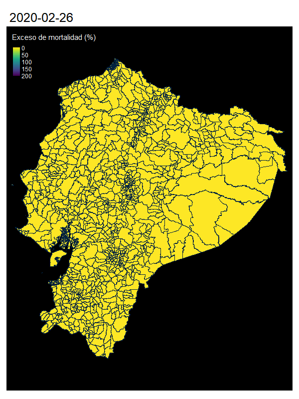

Exceso de mortalidad en Ecuador
================
PBG
31/12/2020

Este análisis busca explorar el exceso de mortalidad como aproximación
de medición de la pandemia de COVID 19 en el Ecuador. Se basa en datos
de fuentes públicas, de defunciones y elementos geográficos en el
Ecuador. También aporta unos elementos de reflexión sobre les
limitaciones para estimar el impacto de la pandemia con este método.
También se encuentra en este repositorio el código de análisis,
realizado con Rmardown (cran-R 4.0.2 y Rstudio 1.3).  
Esta en parte basado sobre el excelente material publicado de Roser et
al.\[1\] [ahí](https://ourworldindata.org/excess-mortality-covid).

Fuentes de datos:

*(1) Informaciones de defunciones generales 2016-2019 publicadas por el
INEC: los datos se encuentran*
[ahí](https://www.ecuadorencifras.gob.ec/defunciones-generales-2019/) y
[aca](https://www.ecuadorencifras.gob.ec/nacimientos-y-defunciones-informacion-historica/).\*  
*(2) Informaciones de defunciones 2020 publicadas por el registro civil
se encuentran actualizadas*
[ahí](https://www.registrocivil.gob.ec/cifrasdef/)  
*(3) Datos geográficos empleados para realizar mapas se encuentran en el
repositorio del INEC*
[ahí](https://www.ecuadorencifras.gob.ec/geoportal/) *y bases del
clasificador de divisiones político administrativas*
[acá](https://www.ecuadorencifras.gob.ec/clasificador-geografico-estadistico-dpa/)
\*\*

\*La información mas completa se encuentra en formato .sav, con
etiquetas de las variables  
\*\*El sitio se encuentra actualmente en mantenimiento (al martes de 31
de diciembre) intente:
[acá](https://www.ecuadorencifras.gob.ec/documentos/web-inec/Cartografia/Clasificador_Geografico/CLASIFICADOR_GEOGRAFICO_ESTADISTICO_2019.zip)

# ‘Exceso de mortalidad’ Que es ? Porque medirlo ? Como se mide ?

Se refiere en epidemiología al número de muertes (todas causas
confundidas) por encima o por debajo de lo esperado comparado con un
periodo “normal”. Con la información disponible veremos como estimarla
sobre distintos intervalos de tiempo, desde el comienzo de la pandemia.

Esta medición, provee un estimado del impacto “total” de una crisis, sin
distinción de la causa de muerte. El exceso estimado suma a las muertes
por COVID-19, muertes por otras causas igualmente atribuibles a las
condiciones de la crisis (p.e. falta de acceso a establecimientos de
salud, movilidad restringida en periodos de confinamiento). Este
indicador refleja el impacto del avance de la pandemia y complementa
información obtenida con campañas de test.

La medida del exceso mortalidad (EM) es igual a la diferencia entre el
número de muertos (M) en un periodo de crisis y el promedio del número
de muertos (PM) durante un mismo periodo de referencia. Sin embargo,
para permitir comparaciones, se usa aqui el *P-score* que refleja la
diferencia porcentual entre muertes en 2020 y muertes en el periodo de
referencia (ilustrado con t(i)):

\[ P-score=\frac{M_{t(i)}-PM_{t(i)}}{PM_{t(i)}} *100 \]

# Resolución y limitación

Datos de exceso de mortalidad a nivel nacional y por provincia han sido
reportados, no siempre actualizados o mas desagregados
[ahí](https://www.economist.com/graphic-detail/2020/07/15/tracking-covid-19-excess-deaths-across-countries)
y
[acá](https://www.nytimes.com/interactive/2020/04/21/world/coronavirus-missing-deaths.html)
y
[acá](https://www.ft.com/content/a2901ce8-5eb7-4633-b89c-cbdf5b386938).
Queremos probar aquí si resulta factible y útil estudiar el fenómeno de
exceso de mortalidad a nivel de parroquias, nivel de desagregación más
alto reportado.No se reporta Galápagos por el momento.

La información actualizada de defunciones presenta dos problemas:  
\- no reporta la codificación numérica de división político
administrativa (DPA), solo cadena de texto como “nombre” de la
parroquia,  
\- ademas, reporta las defunciones por parroquias urbanas (sub-división
de las parroquias cabeceras cantonales), que presentan sinónimos con los
nombres de parroquias no urbanas.

# Codificación de parroquias para comparación inter-anual

Comparando les bases de datos de 2020 con la referencia oficial de DPA
(clasificador estadístico 2019) podemos unificar cadenas de texto
original con las designación del registro civil (comparación aproximada
de cadenas de texto). Para evitar los nombres duplicados, se realizan
las comparaciones dentro de cada cantón (después de depuración de estas
cadenas de texto).  
Aún así, surgen problemas de empate cuando las parroquias contienen
parroquias urbanas, y tienen una parroquia urbana con el mismo nombre
que la parroquia “cabecera de cantón” (más a continuación).

## Clasificador DPA 2019

Los datos del clasificador 2019 (“CODIFICACIÓN\_2019.xlsx” descargado
[ahí](https://www.ecuadorencifras.gob.ec/documentos/web-inec/Cartografia/Clasificador_Geografico/CLASIFICADOR_GEOGRAFICO_ESTADISTICO_2019.zip)
) incluyen las parroquias urbanas. Las parroquias urbanas son
subdivisiones de las Parroquias Cabeceras Cantonales (PCC). Sin embargo,
oficialmente la geografía de las “sub” unidades urbanas no están siempre
definidas geograficamente.

| pro\_n | pro   | can\_n | can    | par\_n | par                 | par\_n\_o | par\_o |
| :----- | :---- | :----- | :----- | :----- | :------------------ | :-------- | :----- |
| 01     | AZUAY | 0101   | cuenca | 010101 | bellavista          | 010150    | CUENCA |
| 01     | AZUAY | 0101   | cuenca | 010102 | canaribamba         | 010150    | CUENCA |
| 01     | AZUAY | 0101   | cuenca | 010103 | el batan            | 010150    | CUENCA |
| 01     | AZUAY | 0101   | cuenca | 010104 | el sagrario         | 010150    | CUENCA |
| 01     | AZUAY | 0101   | cuenca | 010105 | el vecino           | 010150    | CUENCA |
| 01     | AZUAY | 0101   | cuenca | 010106 | gil ramirez davalos | 010150    | CUENCA |

## Unión con defuncción 2020

Las bases publicadas de defunción se unificaron siguiendo tres etapas:  
\- nombres de cantones (manual), - empate aproximado difuso de cadenas
de texto por cantones, - unión de las bases para obtener el código DPA
actualizado (2019)

Las parroquias urbanas de una ciudad no cubren por completo la extensión
de las PCCs y muertes ocurridas en “parroquias cabeceras cantonales” se
encontrarían en estos espacios de geografía no cubiertas por las
extensiones de parroquias urbanas.

Finalmente, para algunos casos, los nombres de las parroquias urbanas
son homónimos (tocayos) de las PCCs al cual pertenecen, dejando
irresuelta la geografía de estas unidades. Al tener resolución exacta
para nombre de PCCs en las ciudades mas grandes, y *ausencia de partes
no “urbanas” en la base de defunciones 2020*, no se procederá a resolver
este problema y se asigna por defecto los números correspondientes a las
parroquias urbanas.

|     | pro   | can\_n | par\_n | pao\_n | par\_o     | fec        |
| --- | :---- | :----- | :----- | :----- | :--------- | :--------- |
| 240 | AZUAY | 0101   | 010101 | 010150 | bellavista | 2020-08-08 |
| 241 | AZUAY | 0101   | 010101 | 010150 | bellavista | 2020-12-10 |
| 242 | AZUAY | 0101   | 010101 | 010150 | bellavista | 2020-04-29 |
| 243 | AZUAY | 0101   | 010101 | 010150 | bellavista | 2020-08-31 |
| 244 | AZUAY | 0101   | 010101 | 010150 | bellavista | 2020-09-09 |
| 245 | AZUAY | 0101   | 010101 | 010150 | bellavista | 2020-08-20 |

# Defunción histórica

Los datos de defunciones históricas 2016 - 2019 fueron compilados,
cubriendo los últimos 5 años.

|      | par\_n | pao\_n | anio\_nac | fec        |
| ---- | :----- | :----- | --------: | :--------- |
| 3808 | 010101 | 010150 |      1964 | 2018-01-10 |
| 4186 | 010101 | 010150 |      1941 | 2018-01-05 |
| 5638 | 010101 | 010150 |      1936 | 2018-04-05 |
| 5639 | 010101 | 010150 |      1939 | 2018-05-05 |
| 5736 | 010101 | 010150 |      1953 | 2018-02-12 |
| 5783 | 010101 | 010150 |      1927 | 2018-02-02 |

Se nota aquí que partes no urbanas de las PCCs faltan en algunos casos
al realizar la unión entre defunción 2020 y datos históricos cuando los
nombres son sinónimos por el problema mencionado anteriormente.

# Información geográfica

Como mencionado anteriormente, los datos de división politico
administrativa a nivel de parroquias estan definidos geograficamente,
sin embargo no existe oficialmente delimitaciones geográficas de
parroquias urbanas.

Juntando información publicada por municipios, estudios geográficos
locales y codificación existente de “zonas” del INEC se realizo una
codificación aproximada en base a las unidades de “zonas” urbanas
definidas por el INEC, que en muchos casos corresponden en extensión a
las definidas por los municipios. Un ejemplo aquí entre las parroquias
reportadas en la pagina wikipedia sobre Quito
(<https://es.wikipedia.org/wiki/Quito>) al a izquierda y las divisiones
de grupos de zonas del INEC a la derecha.

Aquí el área en blanco, corresponde a las extensiones de la Parroquia
“Quito” que no cubren las parroquias urbanas. La correspondencia de
códigos se encuentra en el archivo dpa\_2019\_parrURB\_fin.xlsx en
github.

Uniendo estas entidades geográficas “urbanas” se obtienen mapas tanto a
nivel de parroquias como de “ciudades” definidas por parroquias urbanas.
Aqui un ejemplo con el cantón Quito.

    ## Reading layer `p15' from data source `C:\dd\Google Drive\Mortali\COVID_EC\gis\p15.shp' using driver `ESRI Shapefile'
    ## Simple feature collection with 1033 features and 8 fields (with 1 geometry empty)
    ## geometry type:  MULTIPOLYGON
    ## dimension:      XY
    ## bbox:           xmin: 490690.4 ymin: 9445216 xmax: 1147852 ymax: 10160820
    ## projected CRS:  WGS 84 / UTM zone 17S

    ## Reading layer `p15ur' from data source `C:\dd\Google Drive\Mortali\COVID_EC\gis\p15ur.shp' using driver `ESRI Shapefile'
    ## Simple feature collection with 1301 features and 9 fields (with 1 geometry empty)
    ## geometry type:  MULTIPOLYGON
    ## dimension:      XY
    ## bbox:           xmin: 490690.4 ymin: 9445216 xmax: 1147852 ymax: 10160820
    ## projected CRS:  WGS 84 / UTM zone 17S

# Aggregación de datos

Solo falta unificar la información de defunción a la resolución deseada
y realizar el cálculo de exceso de mortalidad por entidades reportadas.

Aparecen varios casos particulares el en calculo de exceso de mortalidad
donde: - no existen muertes en la entidad en los datos históricos o en
2020, - el exceso por encima de 200 % fue acortado como máximo a 200 %.

## Resumen de exceso de mortalidad por provincias / parroquias

Observado el exceso de muertes por provincia y meses, se nota que
primero y en mayor magnitud fue afectada la costa, donde parece haber
“iniciado” la pandemia, en menor magnitud la sierra y la región
amazónica.

<!-- -->

A nivel de exceso “relativo” (p-score) podemos observar que las
provincias llegaron a un exceso “máximo” hasta el mes de agosto y
septiembre, con una baja de las muertes excendentes despues de estos
meses.

<!-- -->

En el mes de diciembre, los niveles de exceso de mortalidad pueden ser
mas reducidos, sin embargo, *las declaraciones de defunción tienden a
ser incompletas para las ultimas fechas reportadas*, con declaraciones
para el último mes ocurriendo los meses siguientes.

Con la información compilada, mapas nacionales a nivel de parroquias dan
una idea a la difusión e la pandemia mes a mes:

O observado la evolución por provincias (Guayas a la izquierda), dentro
de un cantón (Quito a la derecha).

<!-- -->

Se podría realizar un ajuste por población proyectada, de las muertes de
periodo de referencia, para obtener comparaciones mas precisas con el
periodo 2020…

# Referencias:

\[1\] Max Roser, Hannah Ritchie, Esteban Ortiz-Ospina and Joe Hasell
(2020) - “Coronavirus Pandemic (COVID-19)”. Published online at
OurWorldInData.org. Retrieved from:
‘<https://ourworldindata.org/coronavirus>’ \[Online Resource\]
